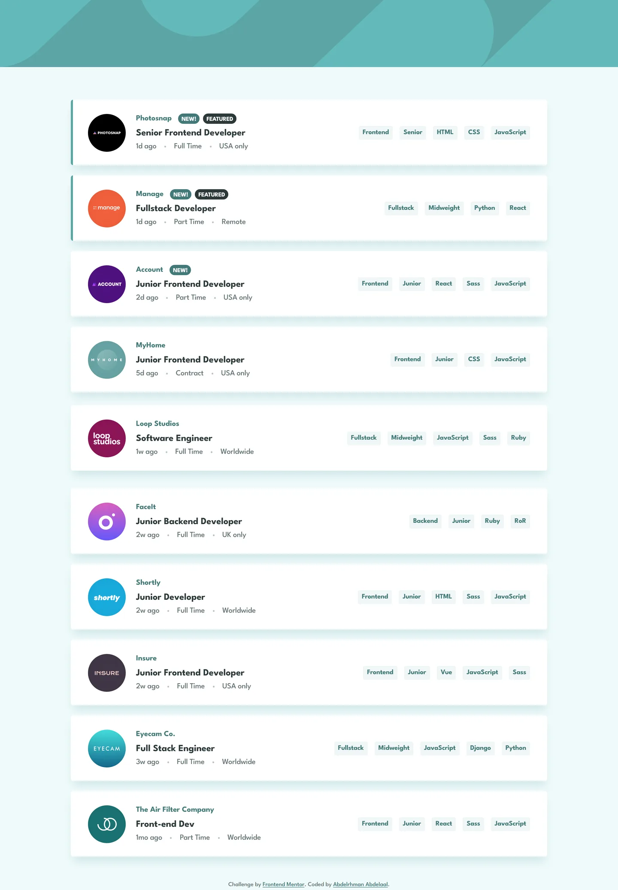

# Frontend Mentor - Job listings with filtering solution

This is a solution to the [Job listings with filtering challenge on Frontend Mentor](https://www.frontendmentor.io/challenges/job-listings-with-filtering-ivstIPCt). Frontend Mentor challenges help you improve your coding skills by building realistic projects.

## Table of contents

- [Overview](#overview)
  - [Screenshot](#screenshot)
  - [Links](#links)
- [My process](#my-process)
  - [Built with](#built-with)
  - [Design deviations](#design-deviations)
- [Author](#author)

## Overview

### Screenshot

### Links

- Solution URL: [GitHub](https://github.com/MrBlackvanta/job-listings-with-filtering)
- Live Site URL: [Cloudflare](https://job-listings-with-filtering.abdelrhman-ahmed8881.workers.dev)

## My process

### Built with

- [Next.js 16](https://nextjs.org/) (App Router, React Compiler, Turbopack, static export)
- [React 19](https://react.dev/)
- [TypeScript](https://www.typescriptlang.org/) (strict)
- [Tailwind CSS v4](https://tailwindcss.com/)

### Design deviations

**The brand cyan darkens from `#5CA5A5` to `#437979` wherever text is involved.** The design's
teal fails WCAG AA in both directions at once — as ink it measures 2.85 on white and 2.60 on the
filter-tablet tint, and as a surface it gives white labels only 2.85. Keeping the surface and
darkening the label instead does not rescue it either: the design's own darkest ink, `#2B3939`, on
`#5CA5A5` reaches only 4.22. So the colour itself has to move. `#437979` holds hue 180 and
saturation 28.9% exactly and lowers lightness from 50.4% to 36.9% — the smallest step that clears
4.5:1 on the tablet tint, which is the tightest of the three backdrops.

**The header band and the featured stripe keep `#5CA5A5` as designed.** Neither carries text, so
neither has a contrast requirement, and the deviation is held to the minimum. The visible
consequence is that on a featured card the 5px stripe and the NEW! badge are slightly different
teals.

**The muted grey darkens from `#7C8F8F` to `#687A7A`** — hue 180 and saturation 7.8% held,
lightness 52.4% → 44.4%. It only ever sits on white, so white is the only constraint.

| | design | contrast | shipped | contrast |
| --- | --- | --- | --- | --- |
| Company name, 18px bold | `#5CA5A5` on `#FFFFFF` | 2.85 | `#437979` on `#FFFFFF` | 4.94 |
| Chip label, 16px bold | `#5CA5A5` on `#EFF6F6` | 2.60 | `#437979` on `#EFF6F6` | 4.51 |
| NEW! badge, 14px bold | `#FFFFFF` on `#5CA5A5` | 2.85 | `#FFFFFF` on `#437979` | 4.94 |
| Chip hover label, 16px bold | `#FFFFFF` on `#5CA5A5` | 2.85 | `#FFFFFF` on `#437979` | 4.94 |
| Remove button icon | `#FFFFFF` on `#5CA5A5` | 2.85 | `#FFFFFF` on `#437979` | 4.94 |
| Meta line + Clear | `#7C8F8F` on `#FFFFFF` | 3.40 | `#687A7A` on `#FFFFFF` | 4.51 |
| Position title, 22px bold | `#2B3939` on `#FFFFFF` | 12.02 | unchanged | 12.02 |
| FEATURED badge, 14px bold | `#FFFFFF` on `#2B3939` | 12.02 | unchanged | 12.02 |

**Every colour is taken from the `.fig`, not the style guide.** The style guide's HSL values round a
point off on four of five: `hsl(180 29% 50%)` gives `#5BA4A4` against the file's `#5CA5A5`,
`hsl(180 8% 52%)` gives `#7B8E8E` against `#7C8F8F`, `hsl(180 14% 20%)` gives `#2C3A3A` against
`#2B3939`, and `hsl(180 31% 95%)` gives `#EEF6F6` against `#EFF6F6`. Only the page background
`#EFFAFA` agrees. Two colours the style guide omits entirely: the header artwork `#63BABA` and the
divider/meta-dot `#B7C4C4`.

**There is no tablet frame, so 640–1087px is designed rather than derived.** The 88px logo moves
inline beside the text column, the divider stays, and the chips keep their own full-width row below
it. Letting the mobile card stretch to 1000px instead would have left a 48px logo alone on a
960px-wide card.

**The desktop row layout starts at 1088px, which is a measured number.** The widest card
(Eyecam Co., five chips) needs 955px of card width before its chip row collides with the text
column; with the design's 40px card padding and ~17px of scrollbar headroom that lands just above
1024, so `lg` would have shipped a layout that breaks on the exact width most likely to find it. At
1088 the tightest card measures 66.2px of clearance.

**The header artwork is inlined into the stylesheet as a data URI rather than served from
`/public`.** The 156px band is the largest above-fold paint and therefore the LCP element, and a
`background-image` request is discovered only after style resolution and fetched at low priority.
Both SVGs reduce to a single path each and total 1.75KB encoded, which rides along in the
already-render-blocking CSS at zero requests. Above 1440px the artwork is `background-size: cover`,
so it scales up and crops vertically; the file provides no frame wider than 1440.

**`html { overflow-y: scroll }` rather than `scrollbar-gutter`.** Filtering changes the page height
enough to add and remove the scrollbar, which shifts the board 7.5px sideways on every click.
`scrollbar-gutter: stable` is the modern fix but cannot be used here: it reserves the space *inside*
the root's content box, so the full-bleed header band stops short of the viewport edge — visibly, on
both sides with `both-edges`. Forcing the scrollbar holds the width constant in every state and
leaves the band running edge to edge.

**There is no empty state, because it is unreachable.** A filter can only be added by clicking a
chip on a card that is currently visible, and that card carries the chip being added, so it always
survives the new filter. At least one job therefore always matches. Clicking a chip whose filter is
already active is a no-op rather than a toggle, which is what the design implies — it draws a hover
state for those chips but no selected state.

**Chip order follows the design, not `data.json`'s category order.** The file draws Account as
`React · Sass · JavaScript` and Insure as `Vue · JavaScript · Sass`, both of which interleave tools
and languages. `location` also uses the design's casing (`USA only`) rather than the starter data's
`USA Only`.

**Small measured deltas that ship as-is.** The company-to-badge gap is a flat 15px on desktop and
30px on mobile, where the file hand-places it at 14–15px and 28–33px across cards. The mobile title
sits 1px below the design (the company-to-title gap is 10px at both breakpoints, where the file
draws 9px on mobile and 10px on desktop). Chip labels are centred in their 32px box rather than
reproducing the file's 5px/3px split.

**Scroll reveals** are transform-only on the card list, gated behind both
`prefers-reduced-motion: no-preference` and `@supports (animation-timeline: view())`. The page
measures 2070px against a 900px viewport at desktop and 3224px at 375px, so they have somewhere to
run.

## Author

- UpWork - [Abdelrhman Abdelaal](https://www.upwork.com/freelancers/mrblackvanta)
- Frontend Mentor - [@MrBlackvanta](https://www.frontendmentor.io/profile/MrBlackvanta)
- LinkedIn - [Abdelrhman Abdelaal](https://www.linkedin.com/in/abdelrhman-vanta/)
